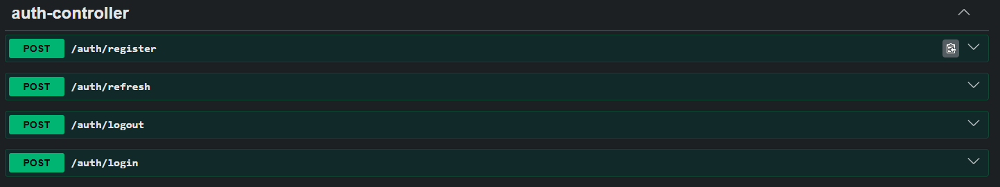
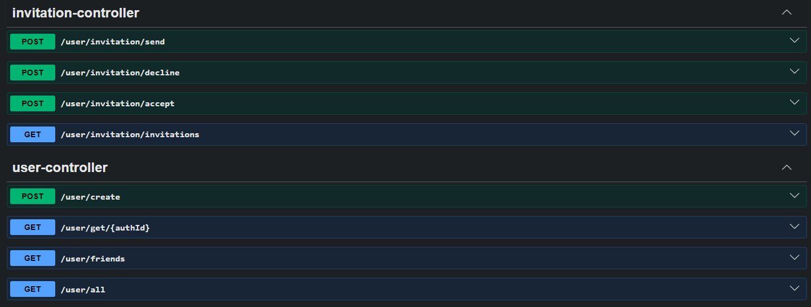
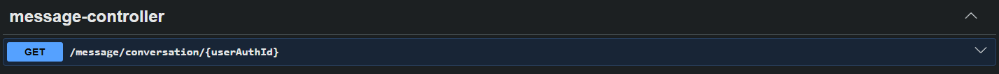
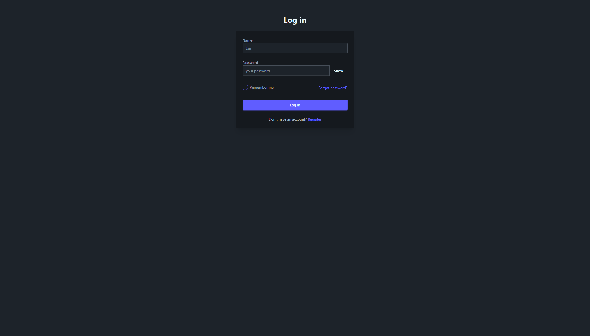
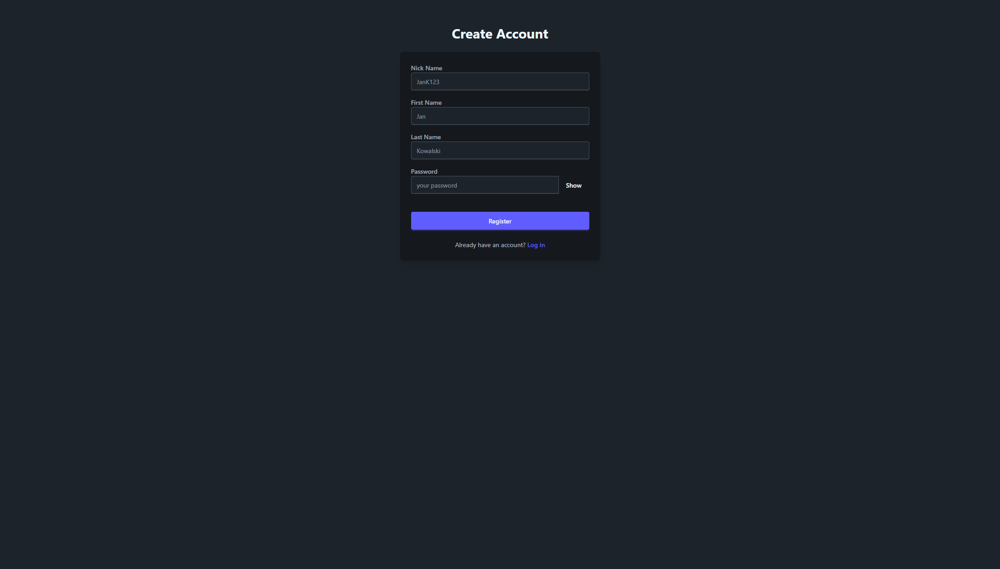
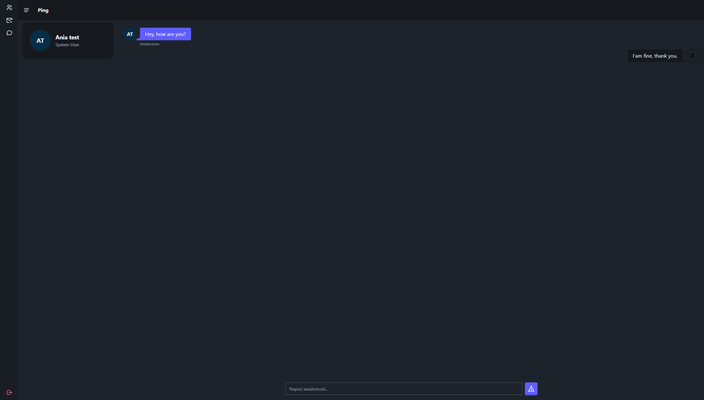
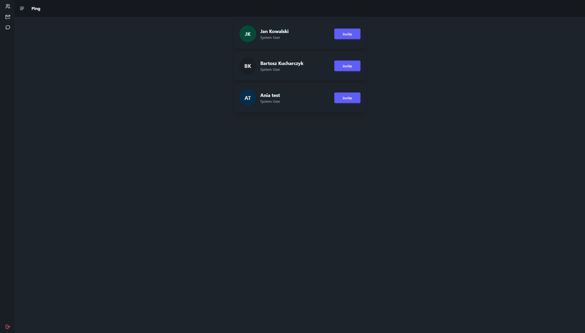
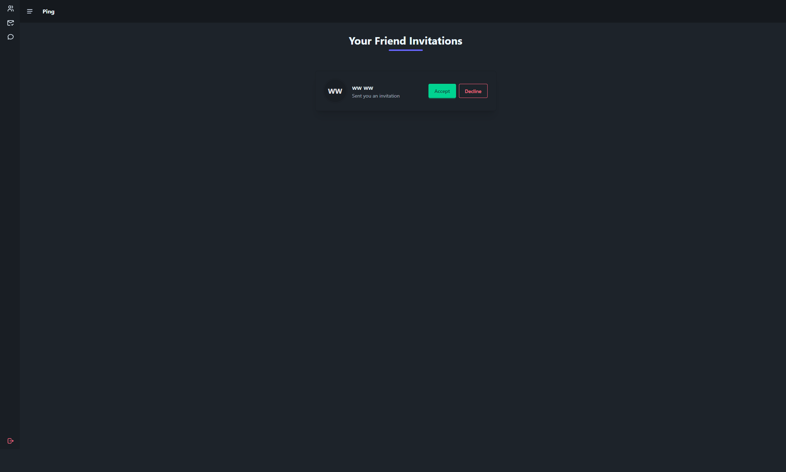

# Ping Chat

A real-time chat application built with **Spring Boot** on the backend and **React** on the frontend with microservice infrastructure, communicating over WebSockets.

---

##  Features

- User authentication with JWT(register & login)
- Real-time messaging via WebSockets (STOMP over SockJS)
- Private direct messaging between users
- Message history
- Friends management with inviting/accepting functionalities
- Responsive UI

---

## 🛠️ Tech Stack

### Backend
| Technology      | Purpose                       |
|-----------------|-------------------------------|
| Java 25         | Core language                 |
| Spring Boot     | Application framework         |
| Spring WebSocket | Real-time communication       |
| Spring Security | Authentication & authorization |
| Spring Data JPA | Database ORM                  |
| PostgreSql      | Relational database           |
| MongoDb         | chat database                 |
| Maven           | Build tool                    |
| Lombok          | Boilerplate reduction         |
| Docker          | Contenerization               |

### Frontend
| Technology              | Purpose            |
|-------------------------|--------------------|
| React                   | UI framework       |
| Vite                    | Build tool         |
| nginx                   | server             |
| SockJS + STOMP.js       | WebSocket client   |
| Axios                   | HTTP requests      |
| React Router            | Client-side routing |
| Tailwind CSS / daisy ui | Styling            |

---

## 📁 Project Structure

```
ChatApplication/
│
├── ApiGateway/                        
├── AuthService/                        
├── UserService/                        
├── ChatService/                       
└── ChatFrontend/                       
└── docker-compose.yaml                   
```

---

##  Prerequisites

Make sure you have the following installed:

- Docker
    
---

## Getting Started

### 1. Clone the repository

```bash
git clone https://github.com/LunarSpectrum92/ping-chat-spring-react.git
cd ping-chat-spring-react
```

### 2. Add environment variables for backend services
Before running the backend services, create a .env file in the service folders and provide the following variables:
    
    - Database Passwords and Usernames
    - JWT secrets for api Gateway and auth service

### 3. Start Docker-compose

```bash
docker-compose up
```

The frontend will be running at **http://localhost:5173**

---


## REST API Endpoints
AuthService:

UserService:

ChatService:

---

## Screenshots

**Login page**



**Register page**



**Chat page**



**Users page**



**Invitation page**




##  License

This project is licensed under the [MIT License](LICENSE).

---

## 👤 Author

**Jarosław Konopka**  
GitHub: [@LunarSpectrum92](https://github.com/LunarSpectrum92)